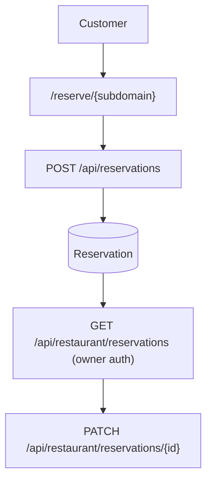
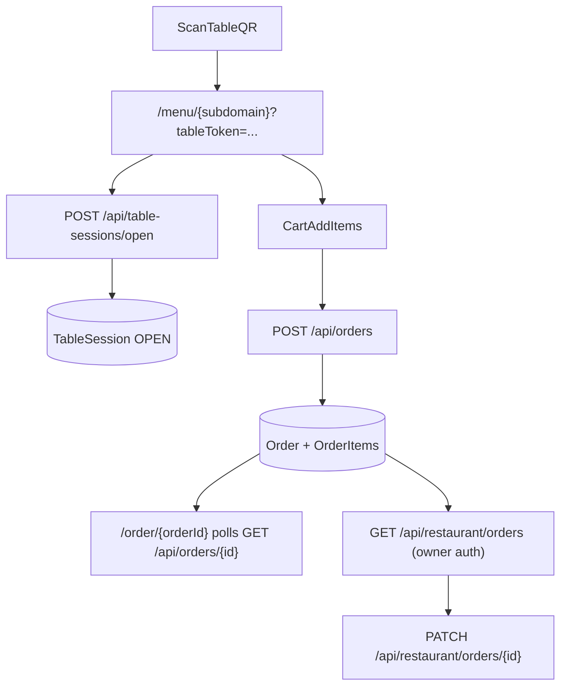

# Reservation + Table Ordering (Waiter Replacement) — Implementation README (MVP)

यह README आपके existing `dineinn_tier2` codebase के ऊपर **Table Reservation** और **Table Self-Ordering** (waiter replacement) जोड़ने के लिए एक step-by-step guide है।

## Default assumptions (इस doc में)
- **Payments**: Pay at counter (online payments नहीं)
- **Realtime**: MVP में polling (SSE/WebSockets later)
- **Tenant model**: हर reservation/order हमेशा किसी एक `RestaurantDetail` से जुड़ा होगा

---

## 1) Current system recap (so we integrate correctly)

आपके पास पहले से:
- Multi-tenant restaurant identity: `RestaurantDetail` (`subdomain`, `restaurantName`)
- Public menu: `/menu/[subdomain]` (server-rendered data → `SubdomainMenuClient`)
- Customer capture: `/api/user` sets `user_token` (Customer JWT)
- Merchant auth: `/api/auth/*` sets `token` + `userId` cookies
- Merchant dashboard: `/restaurant/dashboard` using `/api/dashboard` aggregate

Important: Owner flows cookie-based हैं (JWT `token`), public customer flows `user_token` cookie based हैं।

---

## 2) Feature scope (MVP)

### 2.1 Table Reservation MVP
Customer:
- restaurant subdomain page पर **Reserve a table** (date/time/party size + name + mobile)

Merchant:
- dashboard में reservations list
- confirm / cancel / mark seated / completed

### 2.2 Table Self-Ordering MVP
Customer:
- table QR scan → menu open (already exists) + “This is Table X” context
- cart add/remove items
- place order (no payment)
- order status page (polling)

Merchant:
- dashboard में incoming orders queue
- status updates: accepted → preparing → served → closed

---

## 3) Data model design (Prisma) — MVP

> यह section एक “proposed schema” है; इसे `prisma/schema.prisma` में add करके migrate करना होगा।

### 3.1 Enums
Suggested:
- `ReservationStatus`: `PENDING`, `CONFIRMED`, `CANCELLED`, `SEATED`, `COMPLETED`, `NO_SHOW`
- `OrderStatus`: `PLACED`, `ACCEPTED`, `PREPARING`, `SERVED`, `CANCELLED`, `CLOSED`
- `OrderChannel`: `DINE_IN_TABLE_QR` (future: TAKEAWAY, DELIVERY)

### 3.2 Tables (restaurant seating inventory)
**Model: `DiningTable`**
- `id` (PK)
- `restaurantId` → `RestaurantDetail.id` (FK)
- `label` (e.g. “T1”, “Table 7”, “Patio-2”)
- `capacity` (Int)
- `isActive` (Boolean)
- `qrToken` (unique, random string) — table QR में encode होगा
- `createdAt`, `updatedAt`

Uniqueness:
- `@@unique([restaurantId, label])`
- `qrToken @unique`

### 3.3 Reservation
**Model: `Reservation`**
- `id`
- `restaurantId` (FK)
- `tableId?` (optional FK)  
  - MVP option A: allocate table later (merchant confirms)
  - MVP option B: auto-assign (harder)
- `status` (enum)
- `name` (String)
- `mobile` (String) (not unique; multiple bookings possible)
- `partySize` (Int)
- `startAt` (DateTime)
- `endAt` (DateTime) (MVP: startAt + fixed duration like 90min)
- `notes?`
- `createdAt`, `updatedAt`

Indexes:
- `@@index([restaurantId, startAt])`
- `@@index([tableId, startAt])`

### 3.4 Table Session (for dine-in ordering)
**Model: `TableSession`**
- `id`
- `restaurantId`
- `tableId`
- `sessionToken` (unique random string, encoded in QR link)
- `status`: `OPEN` / `CLOSED`
- `openedAt`, `closedAt?`
- `createdAt`, `updatedAt`

Why: एक ही table पर time के साथ multiple sessions होंगी; orders session से attach होंगे।

### 3.5 Orders
**Model: `Order`**
- `id`
- `restaurantId`
- `tableId?` (for dine-in)
- `sessionId?` (`TableSession.id`)
- `status` (OrderStatus)
- `channel` (OrderChannel)
- `customerId?` → `Customer.id` (optional; link if `user_token` exists)
- `subtotal` (Int) — store as paise/cents (avoid Float)
- `createdAt`, `updatedAt`

**Model: `OrderItem`**
- `id`
- `orderId`
- `dishId` (FK to `Dishes.id`)
- `nameSnapshot` (String)
- `priceSnapshot` (Int) paise/cents
- `quantity` (Int)
- `notes?`

Why snapshots: future में dish price बदलने पर पुराने orders consistent रहें।

---

## 4) QR strategy (how users reach the right context)

आपके पास 2 QR concepts होंगे:

### 4.1 Restaurant Menu QR (already exists)
- points to: `https://{subdomain}.dineinn.shop` (or `/menu/[subdomain]`)
- tracks scans via `/api/restaurant/qrcode/scan-count/{restaurantId}`

### 4.2 Table QR (new)
Table QR should encode:
- `subdomain` (or full url)
- `tableToken` OR `sessionToken`

Recommended link shapes (pick one):
- Option A (table token, session created on first use):
  - `/menu/[subdomain]?tableToken=...`
- Option B (session token in QR; session created by merchant beforehand):
  - `/menu/[subdomain]?sessionToken=...`

MVP recommendation: **Option A**
- Merchant creates `DiningTable` records in dashboard → each table gets a `qrToken`
- Customer scan → backend verifies token and opens/creates `TableSession` automatically

---

## 5) API design (MVP endpoints)

Naming convention: follow your existing App Router routes: `app/api/**/route.ts`

### 5.1 Reservation APIs

Public (no owner auth):
- `GET /api/reservations/availability`
  - query: `subdomain`, `date`, `partySize`
  - returns: available slots (simple)
- `POST /api/reservations`
  - body: `{ restaurantId OR subdomain, name, mobile, partySize, startAt }`
  - creates `Reservation` with `PENDING`

Merchant (owner auth required):
- `GET /api/restaurant/reservations?range=week|month|day`
- `PATCH /api/restaurant/reservations/{id}`
  - body: `{ status, tableId? }`

### 5.2 Table Session APIs (public entry)
Public:
- `POST /api/table-sessions/open`
  - body: `{ subdomain, tableToken }`
  - returns: `{ sessionToken, table: {label, id}, restaurantId }`

### 5.3 Ordering APIs
Public:
- `POST /api/orders`
  - body: `{ sessionToken, items: [{ dishId, qty, notes? }] }`
  - validates table session belongs to restaurant and is OPEN
  - creates `Order` + `OrderItem[]`
- `GET /api/orders/{id}`
  - returns current status + items (for customer order status polling)

Merchant (owner auth):
- `GET /api/restaurant/orders?status=PLACED|ACCEPTED|...`
- `PATCH /api/restaurant/orders/{id}`
  - body: `{ status }`

### 5.4 Shared: Menu fetch remains as-is
Your public menu fetch already exists:
- `GET /api/menu/{restaurantId}` and/or server Prisma select in `/menu/[subdomain]`

For ordering correctness you will need:
- menu list for cart: already in client (`SubdomainMenuClient`) via `menuData.dishes`

---

## 6) UI routes/components (MVP)

### 6.1 Public UI

1) Public menu with table context
- route: `/menu/[subdomain]`
- change: read `tableToken` from query string
- on load: call `/api/table-sessions/open` to get `sessionToken`
- store `sessionToken` in memory/localStorage (MVP choice)

2) Cart + Place order
- Component: `CartDrawer` / `CartSheet` (new)
- Components:
  - `AddToCartButton` inside `DishesCard` or `DishDetailsModal`
  - `CartSummary`
  - `PlaceOrderButton` → calls `POST /api/orders`

3) Order status page
- route: `/order/[orderId]`
- polls `GET /api/orders/{orderId}` every ~3–5 seconds

4) Reservation page
- route: `/menu/[subdomain]/reserve` OR `/reserve/[subdomain]`
- form: date/time selector + party size + name + mobile
- submit: `POST /api/reservations`

### 6.2 Merchant dashboard UI

Dashboard sections (extend your existing `DashboardContent` pattern):
- `reservations`
  - list, filters, status actions
- `orders`
  - “Incoming” queue (PLACED)
  - tabs: accepted/preparing/served/closed

Where to wire:
- `components/DashboardContent.tsx` switch-case add new cases
- Optionally extend `/api/dashboard` aggregate to include:
  - reservations summary
  - order counts

---

## 7) Step-by-step implementation plan (do in this order)

### Step 1 — Add Prisma models + migrate
1. Update `prisma/schema.prisma` with:
   - enums
   - `DiningTable`, `Reservation`, `TableSession`, `Order`, `OrderItem`
2. Run:
   - `npx prisma migrate dev --name add_reservations_orders`
   - `npx prisma generate`

### Step 2 — Add table management (merchant)
1. Create owner-protected endpoints:
   - `POST /api/restaurant/tables` create table + generate `qrToken`
   - `GET /api/restaurant/tables` list
2. Dashboard UI:
   - section `tables` with list + “Generate/Copy QR link”

MVP shortcut: if you don’t want table UI now, seed a few `DiningTable` rows manually in DB.

### Step 3 — Reservation backend
1. `POST /api/reservations`
   - find restaurant by subdomain OR accept restaurantId
   - create reservation with computed `endAt`
2. `GET /api/restaurant/reservations`
3. `PATCH /api/restaurant/reservations/{id}`

Conflict logic MVP:
- If tableId assigned: block overlapping reservations \n  overlap rule: `startAt < existing.endAt && endAt > existing.startAt`
- If tableId is null: allow (merchant assigns later)

### Step 4 — Reservation frontend
1. Create reservation page + form
2. Link it from public menu (e.g. navbar button)

### Step 5 — Sessions + Orders backend
1. `POST /api/table-sessions/open`
   - validate tableToken belongs to restaurant (by subdomain)
   - create/find OPEN session for table (MVP choice: create new each time or reuse same day)
   - return `sessionToken`
2. `POST /api/orders`
   - validate sessionToken and dishIds belong to same restaurant
   - create `Order` + `OrderItem` snapshots
3. `GET /api/orders/{id}`
4. Owner queue:
   - `GET /api/restaurant/orders`
   - `PATCH /api/restaurant/orders/{id}`

### Step 6 — Ordering frontend (public)
1. In `/menu/[subdomain]` client:
   - read `tableToken` from URL
   - open session and keep `sessionToken`
2. Add cart state:
   - simplest: React context in `SubdomainMenuClient`
3. Place order button → redirect to `/order/[id]`

### Step 7 — Merchant orders UI
1. Dashboard section `orders`
2. Polling refresh button (MVP)
3. Status updates buttons

### Step 8 — Hardening checklist
- Rate limiting (at least for `/api/orders` and `/api/reservations`)
- Idempotency for `POST /api/orders` (client double submit)
- Validation: dishId must belong to restaurant
- Sanitize/limit notes length
- Logging: avoid PII in console

---

## 8) Mermaid diagrams (MVP)

### 8.1 ReservationFlow

### 8.2 OrderingFlow

---

## 9) Test plan (MVP checklist)

### Reservation
- [ ] Public reservation create works for a subdomain
- [ ] Merchant can view list and update status
- [ ] Optional: overlap prevention works when table assigned

### Ordering
- [ ] Table QR opens menu and creates/returns session
- [ ] Cart totals stable (snapshots store paise/cents)
- [ ] Place order creates rows and returns order id
- [ ] Merchant queue sees new order
- [ ] Merchant status updates reflect on customer order status page (polling)

---

## 10) Future upgrades (after MVP)

- Realtime: SSE/WebSockets (merchant queue live updates)
- Payments: Razorpay/Stripe
- Kitchen display screen (KDS)
- Item modifiers/add-ons
- Staff roles (non-owner access)
- Reservation slot engine with operating hours + capacity

