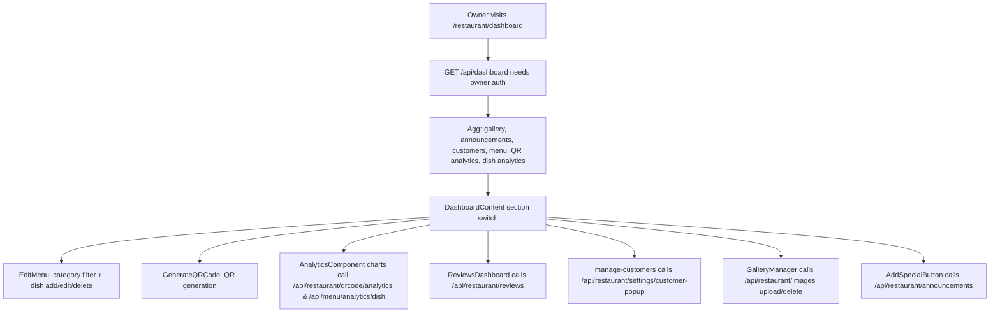

# DineInn Tier2 - Features (Market-Research Style)

यह डॉक्यूमेंट `dineinn_tier2` प्रोजेक्ट की प्रमुख क्षमताएँ (features) और उनके एंड-टू-एंड working का उच्च-स्तरीय, मार्केट-रिसर्च फ्रेंडली विवरण देता है। फोकस backend (`app/api`, Prisma) + frontend (`app`, `components`, `hooks`) के मिलेजुले यूज़र जर्नी पर है।

---

## 1) Product Overview

`DineInn` एक multi-tenant डिजिटल रेस्टोरेंट-मेन्‍यू प्लेटफॉर्म है जहाँ:

- Restaurant owner (merchant) एक custom `subdomain` पर अपना डिजिटल मेन्‍यू (categories + dishes) सेट करता है।
- Customers (viewers) QR/menu लिंक के जरिए उस `subdomain` का public menu देखते हैं।
- Customer experience के दौरान dish views और QR scans ट्रैक होते हैं।
- Merchant dashboard analytics, gallery, announcements, customers और ratings/reviews पर कंट्रोल देता है।

---

## 2) Roles & Access Model

### 2.1 Viewer (Customer)

- Public entry: `/menu/[subdomain]` (auth के बिना)।
- Enablement: customer registration popup (cookie-based) से “locked” अनुभव मिलता है।
- Key actions:
  - Menu browsing (Overview/Menu/Gallery/Updates tabs)
  - Dish details view tracking
  - Restaurant feedback/rating submission

### 2.2 Merchant (Restaurant Owner)

- Authenticated entry: `/restaurant/dashboard` और onboarding routes।
- Protected actions:
  - Restaurant onboarding (create `RestaurantDetail`)
  - Categories + dishes CRUD
  - Gallery upload/list/delete
  - Announcements create/delete
  - QR analytics and dish views analytics
  - Customer list + “customer popup enabled/disabled” setting

---

## 3) Data Model (Prisma) - What Exists in the System

मुख्य Prisma models: `prisma/schema.prisma`

### 3.1 Core Entities

- `User`
  - owner identity: `email` (unique), `password`
  - relation: `restaurantDetail?` (optional 1-1 via `RestaurantDetail.userId @unique`)
- `RestaurantDetail`
  - tenant identity: `restaurantName` (unique), `subdomain` (unique)
  - public branding: `logo`, `instagram`, `facebook`, `location`, `contactNumber`
  - customer popup setting flag: `customerDetailsPopupEnabled`
  - analytics counters: `qrScans` (running total)
  - relations:
    - `categories` (1-to-many)
    - `dishes` (1-to-many)
    - `galleryImages` (1-to-many)
    - `announcements` (1-to-many)
    - `rating` (many-to-one from `RestaurantRating`)
    - `customer` (implicit many-to-many with `Customer`)
    - `dailyQrScans` (1-to-many)
- `Category`
  - `name` per restaurant: `restaurantId` foreign key
- `Dishes`
  - `name`, `price`, `description` (default), `type` (`DishType` enum)
  - `viewsCount` (running total)
  - relations: belongs to `RestaurantDetail` and `Category`
- `DishView`
  - per dish view audit: `dishId`, `timestamp`
- `DailyQRScan`
  - per restaurant per day aggregated scans:
    - `restaurantId`
    - `scanDate @db.Date`
    - `scanCount`
    - unique constraint: `@@unique([restaurantId, scanDate])`
- `RestaurantRating`
  - merchant-facing feedback & analytics base:
    - `rating` (Int), `message?`, `createdAt`
- `Announcement`
  - merchant posts: `title`, `content`, `createdAt`
- `Customer`
  - customer capture:
    - `mobile @unique`
    - optional: `email`, `DOB`
    - relation: linked to restaurants via implicit many-to-many

### 3.2 Running totals बनाम audit tables

- Dish views:
  - audit: `DishView`
  - aggregation: `Dishes.viewsCount` (incremented on view)
- QR scans:
  - audit/aggregation: `DailyQRScan` (upsert per day)
  - running total: `RestaurantDetail.qrScans` (incremented on scan)

---

## 4) Architecture & Key Flows (High-Level)

### 4.1 Auth & Tenancy

- JWT signing/verification: `app/api/auth/*` + `app/lib/middleware/authMiddleware.ts`
- Cookies:
  - owner auth uses `token` and `userId` cookies
  - customer registration uses `user_token` cookie (public side)

### 4.2 Public Menu Flow

```mermaid
flowchart TD
  Start[Customer Opens /menu/{subdomain}] --> Fetch[Server: prisma.restaurantDetail.findUnique by subdomain]
  Fetch --> Show[Client: SubdomainMenuClient renders tabs + menu]
  Show --> Scan[Client calls /api/restaurant/qrcode/scan-count/{restaurantId}]
  Show --> Registration{customerDetailsPopupEnabled AND !user_token?}
  Registration --> Popup[RegistrationPopup -> OptFormModal -> POST /api/user]
  Popup --> Cookie[Server sets user_token cookie]
  Show --> DishClick[DishDetailsModal open -> POST /api/menu/analytics/dish/{dishId}]
  Show --> Feedback[Navbar FeedbackDialog -> POST /api/restaurant/rating]
```


### 4.3 Merchant Dashboard Flow




---

## 5) Feature Chapters (Detailed)

नीचे हर फीचर का template:

- User value
- Who can use
- User journey (front-end)
- Backend/DB working (Prisma + API)
- Key frontend components/hooks
- Security and edge cases
- Metrics

---

## Feature 1: Landing & Viewer vs Merchant Role Detection

### User value

पहली बार आने पर सिस्टम automatically तय करता है कि user एक restaurant owner है या customer, और accordingly redirect करता है।

### Who can use

Public user (unauthenticated)।

### User journey

1. `app/page.tsx` loads और पहले `GET /api/auth/check` (cookie-based) से auth status देखता है।
2. यदि authenticated है तो `/restaurant/dashboard` पर redirect।
3. Otherwise `userTypeDetector.detectUserType()` run होता है:
  - confidence threshold (`0.6`) के आधार पर auto redirect
  - high confidence पर:
    - merchant -> `/onboarding/auth/signin`
    - viewer -> `https://zayka.store`
  - low confidence पर manual selection UI दिखता है।

### Backend/DB working

- `app/api/auth/check/route.ts`:
  - cookie `token` verify करता है
  - response shape: `{ authenticated: boolean, userId?: number }`

### Key files

- `app/page.tsx`
- `lib/userTypeDetection.ts`
- `app/api/auth/check/route.ts`

### Edge cases

- Detection heuristics (referrer/user-agent/url keywords) से गलत role हो सकता है; manual selection allow है।

---

## Feature 2: Merchant Authentication (Signup / Signin / Logout)

### User value

Restaurant owners अपना account बनाकर JWT cookie से protected APIs access करते हैं।

### Who can use

Merchant only (owner auth)।

### User journey

- Signup:
  1. `components/Signup.tsx` user input validate करता है
  2. `POST /api/auth/signup` call करता है
  3. 2 seconds बाद `/onboarding/details` redirect
- Signin:
  1. `components/Signin.tsx` `POST /api/auth/signin` से login करता है
  2. `redirect` query param की मदद से dashboard/onboarding redirect करता है
- Logout:
  - `POST /api/auth/logout` cookies clear करता है।

### Backend/DB working

- `app/api/auth/signup/route.ts`
  - Prisma: `prisma.user.create`
  - sets cookies: `token`, `userId`
- `app/api/auth/signin/route.ts`
  - Prisma: `prisma.user.findUnique` (email + password)
  - signs JWT and sets cookies: `token`, `userId`
- `app/api/auth/logout/route.ts`
  - `token` और `userId` cookies cleared
- `app/lib/middleware/authMiddleware.ts`
  - cookie `token` verify करता है
  - `req.headers` में `userId` / `restaurantId` set करता है (note: दोनों decoded.id से set हो रहे हैं)

### Key files

- `components/Signin.tsx`
- `components/Signup.tsx`
- `app/api/auth/signup/route.ts`
- `app/api/auth/signin/route.ts`
- `app/api/auth/logout/route.ts`
- `app/lib/middleware/authMiddleware.ts`

### Security/Edge cases

- Cookies: `token` + `userId` use होते हैं।
- **Doc risk (consistency issue):** अलग-अलग APIs में cookie `userId` को अलग अर्थों के साथ use किया गया है (कुछ endpoints इसे `User.id` और कुछ इसे `RestaurantDetail.id` मानते हैं)। यह production correctness को प्रभावित कर सकता है।

---

## Feature 3: Restaurant Onboarding (Create Restaurant + Subdomain + Logo)

### User value

Owners एक नया restaurant tenant बनाते हैं और custom subdomain सेट करते हैं जिससे public menu reachable होता है।

### Who can use

Authenticated merchant.

### User journey

1. `components/OnboardingForm.tsx` restaurantName/subdomain/contact/location/hours + social links लेता है।
2. Logo optional file upload:
  - onboarding submit `multipart/form-data` में `logo` send करता है।
3. Success पर `/restaurant/dashboard` redirect।

### Backend/DB working

- `app/api/restaurant/onboarding/route.ts`:
  - `authMiddleware` से owner auth
  - Prisma:
    - reserved subdomain validation
    - `restaurantDetail.subdomain` and `restaurantName` uniqueness checks
    - `restaurantDetail.create`:
      - owner mapping via `userId` cookie
  - Logo:
    - file->base64->Cloudinary upload (`folder: "dishes_image"`)
    - saved as `RestaurantDetail.logo`

### Key files

- `app/onboarding/details/page.tsx`
- `components/OnboardingForm.tsx`
- `app/api/restaurant/onboarding/route.ts`

### Security/Edge cases

- Reserved subdomains list: `www`, `api`, `admin`, `mail`, `ftp`, `blog`
- Regex validation: lowercase letters/numbers/hyphens only
- Length validation: 3..63

---

## Feature 4: Menu Management (Categories + Dishes CRUD)

### User value

Merchant अपने restaurant के menu को categories और dishes के साथ manage करता है, including images और VEG/NON_VEG types।

### Who can use

Authenticated merchant.

### User journey

- Onboarding steps:
  - `app/onboarding/menu/category/page.tsx` -> `components/CategoryForm.tsx`
    - Add category -> `POST /api/menu/category`
  - `app/onboarding/menu/dishes/page.tsx` -> `components/DishesForm.tsx`
    - fetch categories -> per category dish add -> `POST /api/menu/dishes/{categoryId}`
- Dashboard editing:
  - `components/EditMenu.tsx`:
    - select category filter
    - add dish -> `AddDishDialog`
    - add category -> `AddCategoryDialog`
    - delete dish -> `DELETE /api/menu/dishes/{dishId}`
  - `components/EditDishDialog.tsx`:
    - edit dish fields -> `PUT /api/menu/dishes/{dishId}`

### Backend/DB working

- Categories:
  - `app/api/menu/category/route.ts`
    - `POST`: `prisma.category.create`
    - `GET`: `prisma.category.findMany` for owner restaurantId from cookie
- Dishes:
  - `app/api/menu/dishes/[id]/route.ts`
    - `POST` (create):
      - reads `multipart/form-data` -> image upload to Cloudinary
      - Prisma: `prisma.dishes.create` with `categoryId`, `restaurantId`, `type`
    - `PUT` (update):
      - Prisma `prisma.dishes.update` (no image update in current code)
    - `DELETE` (remove):
      - Prisma `prisma.dishes.delete`

### Key files

- `app/onboarding/menu/category/page.tsx`
- `components/CategoryForm.tsx`
- `app/onboarding/menu/dishes/page.tsx`
- `components/DishesForm.tsx`
- `components/EditMenu.tsx`
- `components/AddDishDialog.tsx`
- `components/EditDishDialog.tsx`
- `components/AddCategoryDialog.tsx`
- `app/api/menu/category/route.ts`
- `app/api/menu/dishes/[id]/route.ts`

### Metrics

- Dish view analytics depend on dish modal view tracking (Feature 10/11 below).

---

## Feature 5: Public Restaurant Menu (Tenant Public UI via Subdomain)

### User value

Customers subdomain URL से menu देख पाते हैं:
`/menu/[subdomain]`

### Who can use

Everyone (public).

### User journey

1. Server `app/menu/[subdomain]/page.tsx`:
  - Prisma fetch: restaurant details + nested `categories`, `dishes`, `galleryImages`, `announcements`.
2. Server decides `showRegistrationPopup`:
  - `customerDetailsPopupEnabled` flag
  - and customer cookie `user_token` presence (JWT verified if `NEXTAUTH_SECRET` set)
3. Client `SubdomainMenuClient` renders:
  - Tabs: Overview, Menu, Gallery, Updates
  - Menu search input when active tab is `Menu`
  - Category sticky bar + dish cards grid
  - Registration popup (bottom sheet) if enabled and unregistered
  - Back-to-top and gallery slider behavior.

### Backend/DB working

- Public restaurant fetch:
  - `app/menu/[subdomain]/page.tsx` uses Prisma select
- Public scan tracking on menu load:
  - `SubdomainMenuClient` calls `GET /api/restaurant/qrcode/scan-count/{restaurantId}`

### Key files

- `app/menu/[subdomain]/page.tsx`
- `app/menu/[subdomain]/SubdomainMenuClient.tsx`
- `components/CategoryBar.tsx`
- `components/DishesCard.tsx`
- `components/image-gallery.tsx`
- `components/updates-section.tsx`
- `components/RegistrationPopup.tsx`
- `app/api/restaurant/qrcode/scan-count/[id]/route.ts`

### Edge cases

- `showRegistrationPopup` cookie-based gating:
  - If cookie present and JWT verify ok -> popup hidden.
  - If verify fails -> popup shown based on restaurant flag.

---

## Feature 6: Customer Registration & Lead Capture Popup (WhatsApp-first)

### User value

Restaurant owners को customer leads मिलते हैं और customer personal details/communication permission देता है।

### Who can use

Only those customers who:

- come to public menu and
- `customerDetailsPopupEnabled=true` and
- `user_token` cookie absent.

### User journey

1. `components/RegistrationPopup.tsx`
  - checks `js-cookie` for `user_token`
  - if absent and enabled -> shows bottom `Sheet`
2. `components/OptFormModal.tsx` (actually `FormModal`)
  - step-based UI currently focused on step one (WhatsApp number confirm + privacy checkbox)
  - `Confirm` button triggers submit
3. After submit:
  - `POST /api/user` sends:
    - `name`, `mobile`, optional `email`, optional `dob`, `restaurantId`
  - Server sets `user_token` (httpOnly cookie)
  - Client does `window.location.reload()` so cookie becomes active.

### Backend/DB working

- `app/api/user/route.ts`
  - `POST`:
    - find customer by `mobile` unique
    - create if not exists
    - link customer to restaurant (many-to-many connect)
    - set cookie: `user_token`

### Key files

- `components/RegistrationPopup.tsx`
- `components/OptFormModal.tsx`
- `components/step-one-form.tsx`
- `app/api/user/route.ts`
- `app/menu/[subdomain]/page.tsx` and `app/restaurant/menu/home/[id]/page.tsx` (popup gating server-side)

### Security/Edge cases

- `mobile` is unique: same mobile will reuse existing customer record.
- Cookie name difference:
  - owner auth cookie: `token` / `userId`
  - customer identity cookie: `user_token`

---

## Feature 7: Dish Details Modal + Dish View Tracking

### User value

Customers को dish details तुरंत दिखते हैं और merchant के लिए dish engagement metrics generate होते हैं।

### Who can use

Public menu visitors.

### User journey

1. Customer clicks dish card (`components/DishesCard.tsx`)
2. `DishDetailsModal` opens
3. Modal open होने पर:
  - `useEffect` triggers a POST call to track view

### Backend/DB working

- `components/DishDetailsModal.tsx`
  - triggers `POST /api/menu/analytics/dish/{dishId}`
- `app/api/menu/analytics/dish/[id]/route.ts`
  - Prisma:
    - create `DishView(dishId)`
    - increment `Dishes.viewsCount`

### Key files

- `components/DishesCard.tsx`
- `components/DishDetailsModal.tsx`
- `app/api/menu/analytics/dish/[id]/route.ts`
- `app/restaurant/menu/[id]/page.tsx` and `SubdomainMenuClient` (public UI wiring)

### Metrics

- `DishView.timestamp` for audit
- `Dishes.viewsCount` for fast top-dishes ranking

---

## Feature 8: Restaurant Feedback / Ratings (Customer-to-Merchant)

### User value

Customers simple rating + optional message दे सकते हैं; merchant इसे analytics/dashboard में देखता है।

### Who can use

Public menu visitors.

### User journey

- Feedback Dialog from Navbar:
  - `components/Navbar.tsx` includes `FeedbackDialog` when `id` exists
  - dialog opens -> user selects rating and optional message
  - submit -> POST rating API

### Backend/DB working

- Viewer rating submission:
  - `components/FeedbackDialog.tsx`
    - `POST /api/restaurant/rating` body: `{ restaurantId, stars, message? }`
  - `app/api/restaurant/rating/route.ts`
    - Prisma: `prisma.restaurantRating.create`
- Merchant reads:
  - `components/ReviewsDashboard.tsx` calls:
    - `GET /api/restaurant/reviews?range=week|month|year`
  - `app/api/restaurant/reviews/route.ts`
    - calculates:
      - `summary.totalReviews`, `summary.avgRating`
      - `summary.distribution` (1..5)
      - `points` time series (day-wise or month-wise)
      - `latest` recent submissions (latest 25)

### Key files

- `components/Navbar.tsx`
- `components/FeedbackDialog.tsx`
- `app/api/restaurant/rating/route.ts`
- `components/ReviewsDashboard.tsx`
- `app/api/restaurant/reviews/route.ts`

### Edge cases

- `rating` dialog component exists as `components/rating-dialog.tsx` with `/api/user/review`, लेकिन main menu page में वह commented है:
  - `app/restaurant/menu/[id]/page.tsx` में RatingDialog block disabled

---

## Feature 9: Gallery Management (Upload / View / Delete)

### User value

Merchant अपने restaurant की photos upload करके public menu पर gallery दिखा सकता है।

### Who can use

Authenticated merchant.

### User journey

1. Dashboard section `gallery` in `components/DashboardContent.tsx`
2. `components/GalleryManager.tsx`
  - delete gallery images -> `DELETE /api/restaurant/images/{imageId}`
  - upload images -> `GalleryUploadDialog` -> `POST /api/restaurant/images`
3. Public menu:
  - `components/image-gallery.tsx` renders gallery and allows modal navigation.

### Backend/DB working

- List:
  - `app/api/restaurant/images/route.ts` -> `prisma.restaurantGallery.findMany`
- Upload:
  - `POST /api/restaurant/images`
    - accepts multiple files under `images[]` and/or single `image`
    - uploads each to Cloudinary (`folder: dishes_image`)
    - creates `RestaurantGallery` rows (`imageUrl` stored)
- Delete:
  - `DELETE /api/restaurant/images/[id]`
    - reads DB row to derive Cloudinary public id
    - `cloudinary.uploader.destroy`
    - Prisma delete `prisma.restaurantGallery.delete`

### Key files

- `components/GalleryManager.tsx`
- `components/GalleryUploadDialog.tsx`
- `components/DashboardGallery.tsx` (viewer modal UI)
- `components/image-gallery.tsx` (public UI)
- `app/api/restaurant/images/route.ts`
- `app/api/restaurant/images/[id]/route.ts`

---

## Feature 10: Announcements (Public Updates Section)

### User value

Merchant updates/promotions post कर सकता है, customers उन्हें public Updates tab में देखते हैं।

### Who can use

Merchant create/delete; public customers view.

### User journey

- Merchant:
  - Dashboard default section includes `AddSpecialButton`
  - `AddSpecialDialog` posts title/content
  - announcements list delivered through dashboard aggregate and public menu payload.
- Customer:
  - `components/updates-section.tsx` renders cards
  - Recent announcements highlight (last 24 hours).

### Backend/DB working

- Create:
  - `POST /api/restaurant/announcements`
  - Prisma: `prisma.announcement.create`
  - uses `authMiddleware`
- Delete:
  - `DELETE /api/restaurant/announcements`
  - Prisma: `prisma.announcement.delete` by `id` (from body)

### Key files

- `components/AddSpecialButton.tsx`
- `components/AddSpecialDialog.tsx`
- `components/updates-section.tsx`
- `app/api/restaurant/announcements/route.ts`

### Metrics

- Announcements are content-only (no explicit analytics model in Prisma schema).

---

## Feature 11: QR Codes (Generate) + Scan Analytics

### User value

Merchant अपना menu QR generate करता है; customer scan करने पर daily scan counts और running total बढ़ते हैं।

### Who can use

Generate/analytics: Merchant only. Scan tracking: Public.

### User journey

- Merchant generate QR:
  - Dashboard section `generate-qr` -> `components/QrCode.tsx`
  - fetches `GET /api/restaurant/qrcode/generate-qr`
- Customer scan:
  - landing flow: QR points to tenant URL
  - `SubdomainMenuClient` calls `GET /api/restaurant/qrcode/scan-count/{restaurantId}`
  - or `HomePage.tsx` calls scan-count similarly.
- Merchant analytics:
  - `components/AnalyticsComponent.tsx`:
    - QR chart uses `GET /api/restaurant/qrcode/analytics?range=week|month|year`

### Backend/DB working

- Generate QR:
  - `GET /api/restaurant/qrcode/generate-qr`
  - uses `qrcode.toDataURL(frontendUrl)` where frontend URL constructed from `subdomain`
- Track scan:
  - `GET /api/restaurant/qrcode/scan-count/[id]`
  - upsert `DailyQRScan` for today (unique per restaurantId+scanDate)
  - increment `RestaurantDetail.qrScans`
- Analytics:
  - `GET /api/restaurant/qrcode/analytics`
    - range:
      - `year`: month-wise aggregation (12 points)
      - `week/month`: day-wise points

### Key files

- `components/QrCode.tsx`
- `app/api/restaurant/qrcode/generate-qr/route.ts`
- `app/api/restaurant/qrcode/scan-count/[id]/route.ts`
- `app/api/restaurant/qrcode/analytics/route.ts`
- `components/AnalyticsComponent.tsx`

---

## Feature 12: Dish Analytics (Top Dishes by Views)

### User value

Merchant को पता चलता है कौन सी dishes सबसे ज़्यादा देखी गईं।

### Who can use

Merchant only.

### User journey

1. Dashboard `analytics` section loads.
2. `components/AnalyticsComponent.tsx` fetches:
  - `GET /api/menu/analytics/dish?range=week|month|year`

### Backend/DB working

- `app/api/menu/analytics/dish/route.ts`
  - auth via `authMiddleware`
  - range window based on `lib/analyticsRange.ts`
  - uses `DishView.groupBy(by: dishId, where: timestamp >= start)`
  - selects dishes from the owner restaurant and maps dishId->views
  - returns top N dishes sorted by views.

### Key files

- `app/api/menu/analytics/dish/route.ts`
- `components/AnalyticsComponent.tsx`
- `lib/analyticsRange.ts`

---

## Feature 13: Merchant Dashboard (Aggregated Data)

### User value

एक ही screen पर owners को: menu, gallery, announcements, customers, QR analytics और dish analytics मिलते हैं।

### Who can use

Merchant only.

### User journey

- Route: `app/restaurant/dashboard/page.tsx`
- Server-side helper fetch:
  - `GET /api/dashboard` with cookie header
- UI:
  - `components/DashboardContent.tsx` section switching:
    - default (Welcome + Visitors + actions)
    - `edit-menu`
    - `generate-qr`
    - `edit-profile`
    - `analytics`
    - `reviews`
    - `my-customers`
    - `gallery`

### Backend/DB working

- `app/api/dashboard/route.ts` (auth required)
  - Prisma parallel reads:
    - restaurant details / gallery / announcements / customers
    - menu categories + dishes
    - QR analytics: last 7 days + today (manual array build)
    - dish analytics: top 10 by `Dishes.viewsCount`

### Key files

- `app/restaurant/dashboard/page.tsx`
- `app/api/dashboard/route.ts`
- `components/DashboardContent.tsx`

---

## Feature 14: Merchant Profile Editing (Restaurant Details)

### User value

Owner अपने restaurant details (name/contact/location/social/hours/logo) update कर सकता है।

### Who can use

Merchant only.

### User journey

- Dashboard section `edit-profile` -> `components/ProfileCard.tsx`
- UI save triggers PATCH:
  - `/api/restaurant/details`

### Backend/DB working

- `app/api/restaurant/details/route.ts`
  - `GET`: returns user + restaurantDetail limited fields
  - `PATCH`: Zod validate with `editRestaurantDetailsSchema`
  - Prisma: `prisma.restaurantDetail.update`

### Key files

- `components/ProfileCard.tsx`
- `app/api/restaurant/details/route.ts`

---

## Feature 15: Customer Management (List + Popup Setting)

### User value

Owner को customers की list और उनके mobile/email/DOB मिलता है, साथ में menu popup enable/disable कर सकता है।

### Who can use

Merchant only.

### User journey

- `components/manage-customers.tsx`:
  - loads current toggle setting from `GET /api/restaurant/settings/customer-popup`
  - shows table with search/sort
  - ON/OFF button triggers `PATCH /api/restaurant/settings/customer-popup`
  - WhatsApp action opens `wa.me/<mobile>`

### Backend/DB working

- `app/api/user/route.ts` GET:
  - uses auth to fetch `Customer` records linked to restaurant
- `app/api/restaurant/settings/customer-popup/route.ts`:
  - `GET`: reads `RestaurantDetail.customerDetailsPopupEnabled`
  - `PATCH`: updates flag

### Key files

- `components/manage-customers.tsx`
- `app/api/user/route.ts` (customers list)
- `app/api/restaurant/settings/customer-popup/route.ts` (toggle)

---

## Feature 16: AI Image Generation (Experimental)

### User value

Merchant (or admin) text prompt से menu images generate कर सकता है (current UI usage unknown).

### Who can use

Depends on UI integration; backend endpoint exists.

### Backend/DB working

- `app/api/menu/generate/images/route.ts`
  - expects JSON: `{ prompt }`
  - calls Stability AI text-to-image endpoint
  - returns `{ image: data:image/png;base64,... }`

### Key files

- `app/api/menu/generate/images/route.ts`

---

## 6) Utilities Appendix (How Features Reuse Common Code)

### 6.1 Auth Middleware

- `app/lib/middleware/authMiddleware.ts`
  - JWT verify based on cookie `token`
  - sets `req.headers` user identifiers (both derived from decoded.id)

### 6.2 Analytics Date Range

- `lib/analyticsRange.ts`
  - provides range windows and aggregation keys (`dayKey`, `monthKey`)

### 6.3 Public-side Customer Gating & Cookies

- owner cookies: `token`, `userId`
- customer cookie: `user_token`

### 6.4 Cloudinary Integration

- shared config: `app/lib/cloudinaryConfig.ts`
- used by:
  - onboarding logo
  - dish images
  - gallery images

---

## 7) Known Risks / Consistency Notes (For Accurate Market Claims)

1. **Cookie semantics consistency:**
  - Owner auth cookies set `userId` from `User.id`.
  - कई APIs `userId` को `RestaurantDetail.id` मानकर Prisma queries करते हैं।
  - यह runtime correctness risk पैदा कर सकता है (जब तक database ids aligned न हों)।
  - Audit for correctness:
    - `app/api/menu/route.ts`
    - `app/api/menu/category/route.ts`
    - `app/api/menu/dishes/[id]/route.ts`
    - `app/api/restaurant/qrcode/generate-qr/route.ts`
    - `app/api/restaurant/details/route.ts`
    - `app/api/dashboard/route.ts`
2. **Duplicate rating flows:**
  - FeedbackDialog uses `/api/restaurant/rating`.
  - RatingDialog exists with `/api/user/review`, लेकिन main menu page में commented block मिलता है।

---

